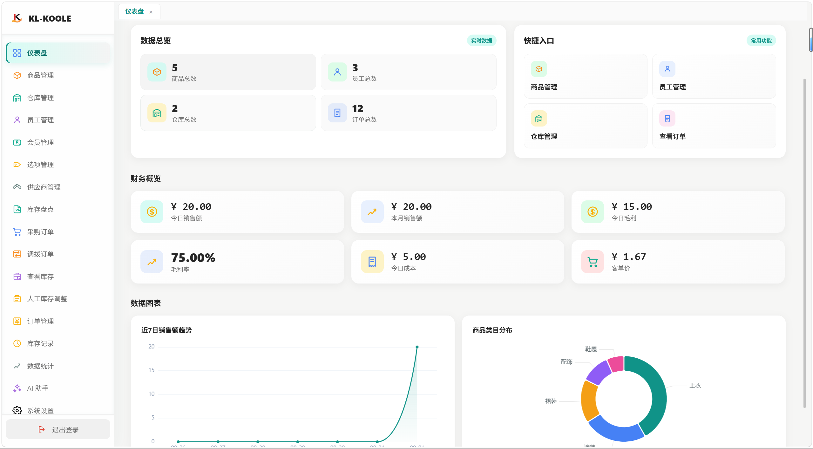
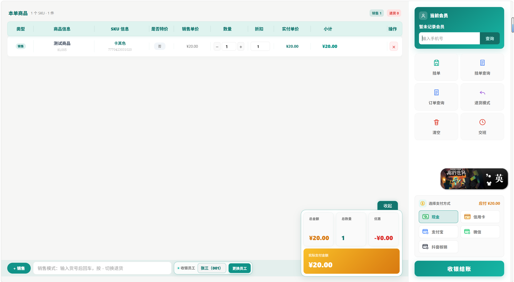
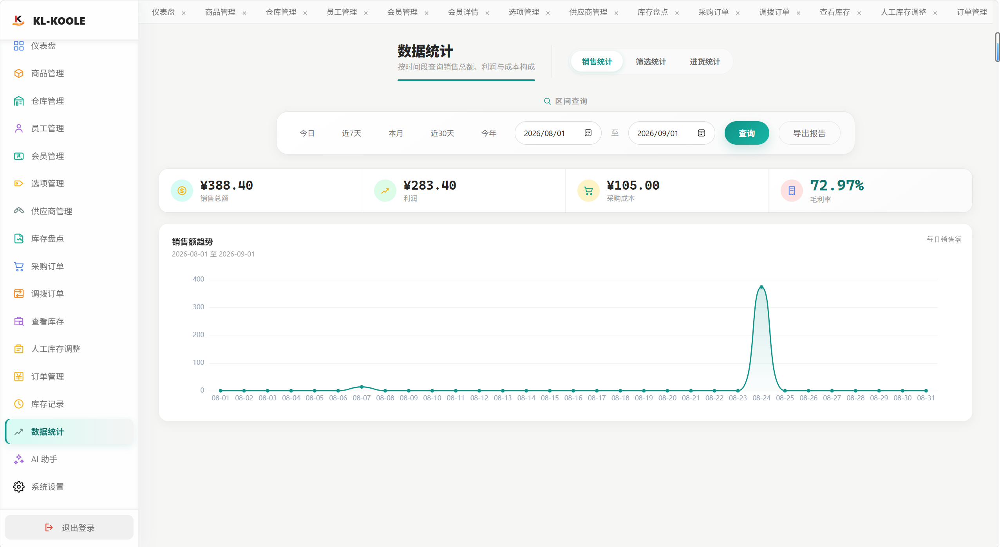
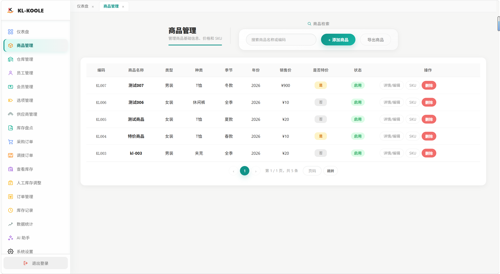
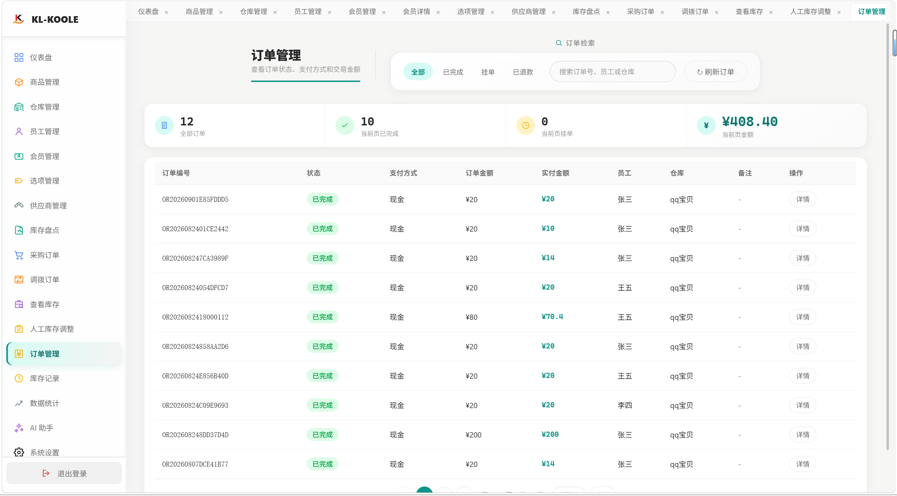
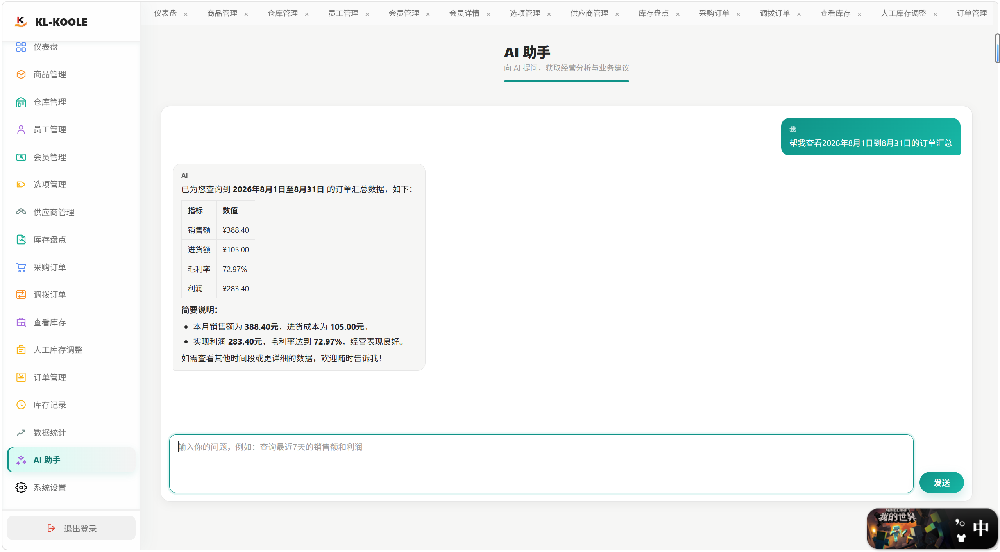

# 服装管理系统介绍 🧥

> - 本服装管理系统是用于管理服装的销售、库存等信息的管理系统。
> - 如果是借鉴学习者，请参考[项目介绍阅读顺序](#推荐项目阅读顺序)，这里会介绍推荐的项目阅读顺序，方便学习 👀

## 项目介绍

- 项目采用了比较经典的分层结构
  - 后端采用的是Entity/Repository/Service/Controller四层结构，采用Info返回前端，Dto返回后端。数据与程序连接层采用`Spring Data JPA`框架。
  - 前端采用的是Vue 3 框架，采用自定义组件，路由采用VueRouter，状态管理采用Pinia。前后端通信采用axios。
- 项目技术栈 ：`Spring Boot 4.0.6` 和 `Vue 3` 框架
- 项目数据库 ：`MySQL` 数据库
- 项目缓存 ：`Redis` 缓存
- 项目日志 ：`Slf4j` 日志框架
- 项目权限 ：`SpringSecurity` 权限框架

## 功能介绍
> 这里介绍一下本系统拥有的功能——小括号代表所属包，尖括号代表覆盖层面的功能 👇
> - 比如：基础管理(`basic`)<`Entity` + `Repository` + `Service` + `Controller` + `Info` + `Dto` + `Converter`>
> - 这代表基础管理所属basic包下，内容主要涉及了Entity、Repository、Service、Controller、Info、Dto、Converter等层次。
> - 其中可能还涉及一些工具类的调用，这里不详细列出，查看代码可以快速理解。

### 基础管理 
> (`basic`)<`Entity` + `Repository` + `Service` + `Controller` + `Info` + `Dto` + `Converter`>
- *管理员(Admin)*: 管理员没有单独的管理页面，需要用户通过数据库插入进行管理（确保管理员权限掌握在系统持有者手中）
- *仓库管理(WareHouse)*: 销售仓库的信息管理
- *员工管理(Employee)*: 员工的信息管理，包括员工的创建、删除、修改、查询等操作。
- *供应商管理(Supplier)*: 供应商的信息维护
- *会员管理(Member)*: 会员的信息维护，可修改用户的等级，以及折扣等

### 商品管理
> (`product`)<`Entity` + `Repository` + `Service` + `Controller` + `Info` + `Dto` + `Converter`>
- *商品管理(Product)*: 销售商品的信息管理，商品的启用和禁用操作
- *商品规格管理(ProductSku)*: 商品的规格管理，包括商品的尺寸、颜色、数量等
- *规格选项管理(OptionValue)*: 商品的规格选项管理，包括商品的尺寸、颜色等选项

### 进销存管理
> (`order`)<`Entity` + `Repository` + `Service` + `Controller` + `Info` + `Dto` + `Converter`>
- *订单管理(Order)*: 由收银台页面(Checkout)生成订单，管理页面可以查看销售的订单信息。
- *进货管理(ImportOrder)*: 用于管理页面，管理员创建进货订单，关联到对应的供应商、仓库和商品，以及商品库存
- *调拨管理(TransferOrder)*: 用于管理页面，管理员创建调拨订单，关联到对应的仓库、商品和数量
- *盘点管理(StockCheckOrder)*: 用于管理页面，管理员创建盘点订单，关联到对应的仓库、商品和数量

### 库存管理
> (`stock`)<`Entity` + `Repository` + `Service` + `Controller` + `Info` + `Dto` + `Converter`>
- *库存管理(WareHouseStock)*: 商品的库存管理，包括商品的库存数量、库存状态等
- *库存记录(StockRecord)*: 记录库存的变更，包括进货、调拨、盘点等操作

### 数据统计
> (`dashboard`)<`Service` + `Controller` + `Info`>
- *订单统计(OrderDashboardService)*: 统计订单的销售、进货、利润、毛利率等指标
- *筛选统计(FilterDashboardService)*: 筛选统计订单的销售、进货、利润、毛利率等指标，但可以根据不同的参数进行筛选汇总
- *进货统计(ImportDashboardService)*: 统计进货订单的金额以及数量等指标，可以根据不同仓库和季节进行筛选汇总

### 登录控制
> (`auth`)<`Service`>
- *Redis认证服务(AuthRedisService)*: 用户记录用户的登录情况，目前配置中允许用户每个账号最多登录两台设备，超过两台设备后，会提示用户退出其他设备

### SpringAI服务
> (`ai`)<`Service` + `Controller` + `Config`>
- *AI聊天服务(AiChatClientService)*: 提供与AI模型的聊天功能
- *AI工具服务(AiToolService)*: 注册与提供AI模型可以使用的工具接口，可以在与AI聊天时提出关键词主动触发并调用对应的工具接口

## 页面展示 📸

### 管理端主页


### 收银台


### 数据看板


### 商品管理


### 订单管理


### AI 对话


## 部署项目 🚀

> 提供两条部署路线，按需选择：
> - **路线 A：Docker 一键部署** —— 最快，适合快速体验（推荐）
> - **路线 B：手动部署** —— 每一步自己动手，适合想了解细节/学习

### 环境要求
- `JDK 17` 及以上
- `MySQL 5.7`（本地，账号 `你自己的数据库账号 / 密码`）
- `Node.js 18` 及以上（前端）
- `Redis`（可选，默认 6379）：**不是必须的**，但如果要使用登录黑名单/会话管理功能，请务必安装
- `AI 服务`（可选）：**不是必须的**，不配置也能正常启动，只是 `/api/ai/chat` 对话接口不可用

### 拉取项目
```bash
git clone https://github.com/KLTaekwondo/Clothing-system.git
cd Clothing-system
```

---

## 路线 A：Docker 一键部署 🐳（推荐）

> 需要本机已安装 Docker 和 Docker Compose。

```bash
# 一键启动全部服务（MySQL + Redis + 后端 + 前端）
docker compose up -d --build

# 查看启动日志（确认后端起来、表建好）
docker compose logs -f backend
```

- 前端访问：`http://localhost:5173`
- 后端接口：`http://localhost:8080`
- 数据库/Redis 端口已映射到宿主机（MySQL 3307 / Redis 6379）

**默认账号自动创建**：MySQL 容器首次启动会自动执行 `init-data.sql`（建表 + 灌入默认账号），无需手动导入。
> 注意：如果 MySQL 数据卷已存在（之前跑过），初始化脚本不会重复执行，需手动导入 `backend/src/main/resources/init-data.sql`。

**停止服务**：
```bash
docker compose down
```

**可选：启用 AI 对话**
```bash
# 在 docker-compose.yml 所在目录，设置环境变量后重启后端
# Windows PowerShell：
$env:DEEPSEEK_API_KEY = "你的密钥"
docker compose up -d --build backend
# macOS / Linux：
# DEEPSEEK_API_KEY=你的密钥 docker compose up -d --build backend
```

---

## 路线 B：手动部署 🛠️

> 适合想自己动手、了解每一步的人。

### 1. 准备数据库 ⚠️
> **⚠️ 必做：必须先创建数据库 `ClothingSystem`，否则后端启动会失败！**
> 后端连接的是 `jdbc:mysql://localhost:3306/ClothingSystem`（见 `application-dev.properties`），
> 数据库不存在时启动直接报错。

```sql
-- 在 MySQL 中执行（账号 root/123456，或用你自己的账号）
CREATE DATABASE IF NOT EXISTS ClothingSystem DEFAULT CHARACTER SET utf8mb4;
```

- 表结构有两种方式生成，任选其一：
  - **方式一**：直接执行 `init-data.sql`（内含建表 + 灌数据，一次搞定）
  - **方式二**：先启动后端让 JPA 自动建表（`ddl-auto=update`），再手动导入 `init-data.sql` 的"灌数据"部分
- 初始化数据导入（可选）：`backend/src/main/resources/init-data.sql`
  - 内含默认管理员 `admin001 / 123456`、仓库 `WH001/WH002 / warehouse`
  - 不导入也能启动，只是没有账号，需要自己创建管理员

### 2. 启动 Redis（可选，使用黑名单/会话管理必装）📦
```bash
# 拉取 Redis 镜像（已拉过可跳过）
docker pull redis:7

# 启动 Redis 容器（映射 6379 端口，后台运行）
docker run -d --name clothing-redis -p 6379:6379 redis:7
```
- Redis 启动在 `localhost:6379`
- 验证：`docker ps` 看到 `clothing-redis` 容器运行中即可
- 如果后端检测不到 Redis，会**自动降级放行**（登录黑名单/会话管理不可用，但不影响其他功能）

### 3. 启动后端 🖥️
```bash
cd backend
# （可选）设置 AI 密钥——不配置也能正常启动，只是 AI 对话接口不可用
# Windows PowerShell：
$env:DEEPSEEK_API_KEY = "你的密钥"
# macOS / Linux：
# export DEEPSEEK_API_KEY="你的密钥"

# 启动（默认 dev profile，连本地 MySQL/Redis）
.\mvnw.cmd spring-boot:run
```
- 后端启动在 `http://localhost:8080`
- 这里的 `DEEPSEEK_API_KEY` 只是一个环境变量名称，你可以使用自己的环境变量名称和密钥

### 4. 启动前端 💻
```bash
cd frontend
npm install
npm run dev
```
- 前端启动在 `http://localhost:5173`（Vite 默认端口）

---

## 演示账号 🔑
> 账号数据来自 `backend/src/main/resources/init-data.sql`（需先导入）

| 角色 | 账号 | 密码 |
|------|------|------|
| 管理员 | `admin001` | `123456` |
| 仓库 | `WH001` | `warehouse` |
| 仓库 | `WH002` | `warehouse` |

## 验证
- 浏览器打开前端地址，用演示账号登录
- 或直接调接口：`POST /api/admin/login`（body: `{"account":"admin001","password":"123456"}`）

## 推荐项目阅读顺序

### 后端阅读顺序
#### 1.`Entity`：实体模块，定义映射数据库表的字段和关系

- 建议从`basic`包看起，里面都是比较简单的实体类，涉及的字段联系不算多，也是系统管理的基本单位 👀
- 看完`basic`后，建议`product`包看起，`Product`和`Sku`的关系可以说得上是**最经典的情景之一** 💡，
  因为你需要思考product关联到sku的时候，到底是**一对一**，还是**多对一**，亦或者其他的关系，应该对了解**强关联问题**有比较好的帮助。
- `product`也了解完，就可以开始了解整个系统中**最复杂**的`order`模块，***order这个数据模型几乎是每个软件工程必须要面对的一个模型之一***。
  - 其一是：它需要保留快照的特性，要求你**部分字段必须弱关联** 📸。
  - 其二是：它对父子关系的层级了解有很大帮助，这里可以了解到——为什么你要采用**级联关系**，为什么你要采用**强关联中最复杂的双向关联**。

#### 2.`Repository`：数据访问层，定义数据库操作的方法

- **数据访问层，是程序和数据库之间的重要桥梁**。这一个模块可能没有什么具体可以看的，但是你需要掌握比较好的`数据库语法`，
  再了解一下JPQL的具体用法，想想看，**JPQL**和**原生数据库**的语法差别在哪里？
- 如果一定要推荐一个的话，我可能比较推荐：`OrderRepository.java` 和 `WareHouseStockRepository.java` 🎯
  - order的数据层**基本上都是JPQL的写法**。
  - stock这边则是有一条悲观锁查询函数`findByIdForUpdate()`，**可以看看在什么条件下JPQL可以转化为原生的SQL语句**。
  
#### 3.`Info`：信息模块，定义返回前端的信息格式
- **返回前端信息的承载类**：为什么需要单独立一个类用来返回数据库的字段呢？其实，这是因为有的时候，数据库字段是非常隐私的，比如用户的**手机号**和**密码** 🔒。
  想想看，如果你把实体类返回到前端，虽然这确实是方便了，但是你公司客户的信息就全网裸奔啦！所以需要用单独的类对数据进行清理，**确保隐私字段不对所有人可见**，只在后端流转。
- 这个模块确实也没什么可以看的，**主要是锻炼自身对隐私数据的敏感性，多多思考这个数据是否应该返回前端、是否安全、是否会被不轨之人拿取进攻系统**。

#### 4.`Converter`：转换器，定义将数据库实体转换为前端信息格式的方法
- 转换器模块可以随意挑选一个类，**仔细学习一下Builder的用法**，你也可以使用**全参构造函数**，这个是看自己的个人的使用习惯。
- 转换器其实也没有什么高深的，就是一种工具——用来把Entity的字段集中清洗后，回写到info的字段中，本质上可以不写这个类。
  但是一般为了美观和调用方便性——推荐写一个转换类帮你快速转换，这不仅有利于你保持Service层的逻辑集中，还能你写代码写的简洁。

#### 5.`Service`：服务模块，定义业务逻辑的方法
- 服务层，推荐顺序按照Entity来，从最简单的`basic`开始了解，了解一下Service层的作用，以及注入Repository工具后，如何实现查询数据的。
- 进阶看`product`，这里涉及到连续生成的情况，比如：你准备创建一个product，这个product下有很多的sku，可以仔细看看处理方式，比如注入SkuService方便调用。
- 然后依旧是`order`这里涉及了你处理金额的时候，思考一下你到底是应该只采用前端传回的金额呢，还是后端计算出来金额后和前端校验后的数据呢？
  - order这一块，不仅涉及了**子项item**的生成，同时还涉及了关联product的情况，**你怎么去调用库存管理模块对产品数量进行增删**，*个人觉得这一块可能需要花很长时间了解，但也是最有价值的一块* 💎

> - 这里需要提醒一下：**Service层按理来说是可以随意调用同级或者低一级的层的。**
> - 比如**Service最主要是调用Repository层**，这个时候Service可以随意调用Repository。
> - 但是如果是**同级**，最好不要**互相调用**，否则可能出现循环调用，导致系统崩溃。比如productService调用了skuService，而skuService又反过来调用了productService。

#### 6.`Controller`：控制器模块，定义处理前端请求的方法
- 控制器层，最外壳的一层，**用来将你写好的Service层函数，包装成API接口，然后安全暴露给前端使用**。
- 控制器也是随便挑一个学习即可，主要是了解，**怎么让Service层的函数，经过@RequestMapping的路径转发**，变成一个**可以使用的接口**。
- 同时你还可以了解`@GetMaping`、`@PostMapping`、`@DeleteMapping`和`@PutMapping`的具体使用情况，了解到什么时候该用什么注解。

> 这里讲解一下：`Get`一般是从后端拿取数据、`Post`是传入数据，创建一个新的数据、`Put`是传入修改数据，修改已经存在的数据、`Delete`很好理解，就是删除已经存在的数据。
> - 重要提示：**Controller一般只调用Service，最好不要跨级调用Repository**，虽然说这可以运行，但是你也不想被骂吧 🚧，**Controller层一般只做转发，不做逻辑**。
> - 同时逻辑一部分写在Controller，一部分又写在Service，容易让大家心智负担增加，不好维护代码的同时，你还容易挨骂哦。

#### 7.`Dto`：包揽前端参数的类，用于集中参数，方便后端提取和使用
- dto层其实就是把后端所需要的参数包装起来，不仅方便前端，将参数包装起来，一起发往后端，也方便后端集中提取数据，不需要东找西找。
- dto也可以随便找一个类了解，主要是要知道`@Valid`和`@RequestBody`的作用，比如你想让一个字段不为空的时候，
  那么这个时候你就可以在dto的字段前面加上——`@NotNull`、`@NotBlank`等注释，这些可以帮你筛选前端的非法数据，并在控制台告诉你 ✅。
- 好吧，其实dto也不是强制的，但是为了你后期不被数据缺失烦恼，推荐你还是写吧~ 😄

#### 8.`Result`：统一返回格式，前后端通信的"通用语言" 📦
- 所有接口的返回值，最终都会包装成 `Result<T>` 的格式：`{ code, msg, data }`。`code` 是状态码（200 成功、400 参数错误、401 未登录……），`msg` 是提示信息，`data` 是真正的数据。
- 为什么要统一？如果没有它，每个接口返回格式都不一样，前端就要为每个接口写一套解析逻辑——有了它，前端只需要处理一种结构，就像大家都用同一个"充电接口" 🔌。
- 它提供了几个静态方法，直接调用即可：
  - `Result.success(data)`：有数据时返回成功
  - `Result.successMessage(msg)`：无数据时返回成功消息（比如"删除成功"）
  - `Result.error(code, msg)`：有错误码时返回错误（比如业务校验失败）
  - `Result.errorMessage(msg)`：默认错误码 400 返回错误
- 结合`全局异常处理`一起看：业务代码里 `throw new BusinessException(ErrorCodeEnum.XXX, "提示")`，全局异常处理器捕获后统一转成 `Result.error(code, msg)` 返回，前端收到的永远是同一种结构 ⚙️

### 前端阅读顺序

前端代码量较大（60+ 组件），建议按"运行主线"阅读，从"程序怎么跑起来"到"业务页面长什么样"：

1. **入口**：`main.js` —— 应用的启动入口，看它注册了哪些插件（Pinia、Router），了解前端的地基
2. **路由**：`router/router.js` + `router/ManageChildren.js` —— 看路由怎么组织（登录页、管理端、收银台），了解页面怎么跳转
3. **状态管理**：`stores/`（userStore、theme、toastStore 等）—— Pinia store，看登录态、主题、提示等全局状态怎么管理
4. **请求层**：`axios/backendService.js` —— **前端核心**，看 axios 封装和拦截器（401 跳登录、403/422/500 分支处理），再看 `axios/api/`（各模块的接口调用）
5. **页面主线**：
   - 先看 `page/auth/Login.vue`（登录流程，和请求层联动最紧密）
   - 再看 `page/checkout/Checkout.vue`（收银台，核心业务页面）
   - 最后看 `page/manage/`（管理端各模块：商品、订单、库存、会员、统计等）
6. **组件**：`component/`（公共组件：分页、弹窗、Toast 等），了解复用

> 前端有 `page/`（页面）和 `component/`（组件）之分：页面是"路由对应的一整屏"，组件是"页面里复用的积木"。先看页面再看组件，理解更快 🧩

